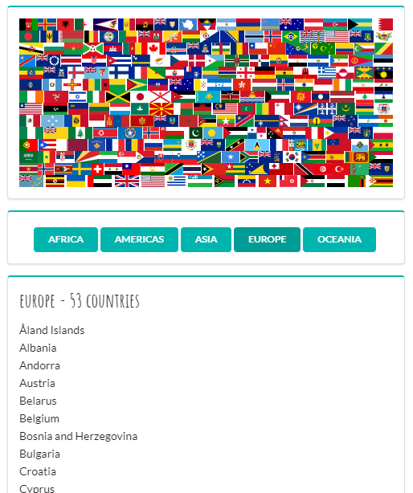

## Countries app

Practicing how to use useState and useEffect hooks, reuse code and perform typechecking with PropTypes.

### App

### Stack

-   React
-   React DOM
-   PropTypes
-   Axios
-   Rest countries API (<https://restcountries.eu/>)
-   Semantic UI
